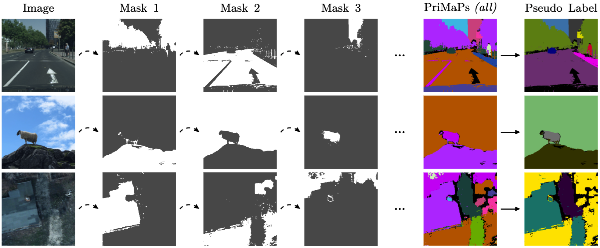

# Boosting Unsupervised Semantic Segmentation with Principal Mask Proposals

[](https://opensource.org/licenses/Apache-2.0)
[](https://pytorch.org/)

This is the official repository of our paper:

**Boosting Unsupervised Semantic Segmentation with Principal Mask Proposals**<br>
[Oliver Hahn](https://olvrhhn.github.io),
[Nikita Araslanov](https://arnike.github.io),
[Simone Schaub-Meyer](https://schaubsi.github.io),
and [Stefan Roth](https://www.visinf.tu-darmstadt.de/visual_inference/people_vi/stefan_roth.en.jsp)<br>
**TMLR Sep. 2024** 

[[OpenReview](https://openreview.net/forum?id=UawaTQzfwy)] [[ArXiv](https://arxiv.org/abs/2404.16818)] [[Project Page](https://visinf.github.io/primaps/)] [[Demo](https://huggingface.co/spaces/olvrhhn/PriMaPs)]

**Abstract:** Unsupervised semantic segmentation aims to automatically partition images into semantically meaningful regions by identifying global categories within an image corpus without any form of annotation. Building upon recent advances in self-supervised representation learning, we focus on how to leverage these large pre-trained models for the downstream task of unsupervised segmentation. We present <i>PriMaPs</i> - Principal Mask Proposals - decomposing images into semantically meaningful masks based on their feature representation. This allows us to realize unsupervised semantic segmentation by fitting class prototypes to <i>PriMaPs</i> with a stochastic expectation-maximization algorithm, <i>PriMaPs-EM</i>. Despite its conceptual simplicity, <i>PriMaPs-EM</i> leads to competitive results across various pre-trained backbone models, including DINO and DINOv2, and across datasets, such as Cityscapes, COCO-Stuff, and Potsdam-3. Importantly, <i>PriMaPs-EM</i> is able to boost results when applied orthogonally to current state-of-the-art unsupervised semantic segmentation pipelines. 



Figure 1: Principal mask proposals (PriMaPs) are iteratively extracted
from an image (dashed arrows). Each mask is assigned a semantic class resulting in a pseudo label.


## News
- `27/11/2024`: Code, checkpoints, and gradio demo released.
- `10/09/2024`: Paper has been accepted to [TMLR](https://openreview.net/forum?id=UawaTQzfwy)! 🎉 
- `25/04/2024`: [ArXiv](https://arxiv.org/abs/2404.16818) preprint released.

## Installation 
This project was originally developed with Python 3.6.9, PyTorch 1.10, and CUDA 11.0. We used a single NVIDIA A6000 (49GB). Create the conda environment as follows:

```
conda create --name primaps python==3.6.9 torchmetrics=0.10.3 -c conda-forge

source activate primaps

python -m pip install torch==1.10.0+cu113 torchvision==0.11.1+cu113 torchaudio==0.10.0+cu113 -f https://download.pytorch.org/whl/torch_stable.html

pip install -r requirements.txt

pip install git+https://github.com/lucasb-eyer/pydensecrf.git
```

We have observed that the metric performance can vary when library dependencies are not properly taken into account and different hardware is used. 

## Demo
We provide a simple demo to obtain and visualize PriMaPs from a given image in ```demo.py```.


## Datasets
Download the datasets from their original source ([Cityscapes](https://www.cityscapes-dataset.com), [COCO-Stuff](https://download.visinf.tu-darmstadt.de/data/from_games/), [Potsdam-3](https://www.isprs.org/education/benchmarks/UrbanSemLab/2d-sem-label-potsdam.aspx)). Alternatively, follow the [STEGO](https://github.com/mhamilton723/STEGO) dataset preperation.

## Generate PriMaPs Pseudo Labels
Before the actual training the PriMaPs pseudo labels are pre-computed and stored. Run the following command and adjust to the desired dataset and backbone architecture.
```
python train.py --precomp-primaps --threshold 0.4 --dataset-root /path/to/datasets/cityscapes --backbone-arch dino_vits --backbone-patch 8 --dino-block 1 --batch-size 32 --validation-resize 320 --crop-size 320 --num-workers 8 --augs-randcrop-scale 1. 1. --augs-randcrop-ratio 1. 1. --log-name my_experiment --gpu-ids 0
```

## Train
For initialization we train for two epochs minimizing the cosine
distance batch-wise K-means. If the number of epochs is increased accordingly, this command corresponds to the baseline training.
```
python train.py --pcainit --dataset-root /path/to/datasets/cityscapes --backbone-arch dino_vits --backbone-patch 8 --dino-block 1 --batch-size 32 --train-state baseline --validation-resize 320 --crop-size 320 --num-workers 4 --num-epochs 2 --linear-lr 5e-3 --augs-randcrop-scale 1. 1. --augs-randcrop-ratio 1. 1. --gpu-ids 0 --log-name my_experiment
```

This is followed by the actual training using the pre-computed PriMaPs pseudo labels and the initialization checkpoint.

```
python train.py --cluster-ckpt-path /path/to/init/checkpoints/checkpoint/last.ckpt --student-augs --dataset-root /path/to/datasets/cityscapes --backbone-arch dino_vits --backbone-patch 8 --dino-block 1 --batch-size 32 --validation-resize 320 --crop-size 320 --num-workers 4 --num-epochs 50 --linear-lr 5e-3 --ema-update-step 10 --ema-decay 0.98 --precomp-primaps-root /path/to/datasets/cached_datasets/primaps_cityscapes/ --seghead-lr 5e-3 --seghead-arch 'linear' --augs-randcrop-scale 1. 1. --augs-randcrop-ratio 1. 1. --gpu-ids 0 --log-name my_experiment
```


### Train with STEGO or HP
Add the original code to the ```external``` folder. The used STEGO checkpoints are provided in the original [STEGO repository](https://github.com/mhamilton723/STEGO). For [HP](https://github.com/hynnsk/HP) we reproduced the paper results and provide the used checkpoints for download [here](https://drive.google.com/drive/folders/13nAIRNxYewQ7wNLAtoV9bXGHaaOcrg_5?usp=drive_link). The pre-computed pseudo-labels of the respective DINO backbone are used and no initialization checkpoint is needed. For training with STEGO run:

```

dataroot='/fastdata/ohahn/datasets/cityscapes'
stegockpt='/visinf/home/ohahn/code/STEGO/saved_models/cityscapes_vit_base_1.ckpt'
pseudo='/fastdata/ohahn/datasets/cached_datasets/minimal320_04low/CS_dino_vitb8_cached-320-04lowminimal_105234'
decay=0.98
lr=5e-3
python train_clean.py --log-name my_experiment --student-augs --seghead-focalloss 2.0 --dataset-root $dataroot --stego-ckpt $stegockpt --backbone-arch dino_vitb --backbone-patch 8 --dino-block 1 --batch-size 32 --validation-resize 320 --crop-size 320 --num-workers 4 --num-epochs 50 --linear-lr 5e-3 --ema-update-step 10 --ema-decay $decay --precomp-pseudos-root $pseudo --seghead-lr $lr --seghead-arch 'linear' --augs-randcrop-scale 1. 1. --augs-randcrop-ratio 1. 1. --gpu-ids 0
```

For HP:
```
dataroot='/fastdata/ohahn/datasets/cityscapes'
pseudo='/fastdata/ohahn/datasets/cached_datasets/minimal320_04low/CS_dino_vits8_cached-320-04lowminimal_103313'
hp_ckpt='/visinf/home/ohahn/code/HP/checkpoints/hp_vits8_cs/experiment_name/'
hp_opt='/visinf/home/ohahn/code/HP/checkpoints/hp_vits8_cs/option.json'
decay=0.98
lr=5e-3
python train_clean.py --seghead-focalloss 2.0 --log-name $name --student-augs --dataset-root $dataroot --hp-ckpt $hp_ckpt --hp-opt $hp_opt --backbone-arch dino_vits --backbone-patch 8 --dino-block 1 --batch-size 32 --validation-resize 320 --crop-size 320 --num-workers 4 --num-epochs 50 --linear-lr 5e-3 --ema-update-step 10 --ema-decay $decay --precomp-pseudos-root $pseudo --seghead-lr $lr --seghead-arch 'linear' --augs-randcrop-scale 1. 1. --augs-randcrop-ratio 1. 1. --gpu-ids 0

```

## Test
To evaluate the trained checkpoint, run the following command. The config is stored in the checkpoint.
```
python test.py --checkpoint-path /path/to/checkpoint.ckpt --dataset-root /path/to/dataset
```


## Main Results
We provide a script to reproduce the main results on the Cityscapes dataset in `experiments.sh`.


## Downloads
[Here](https://drive.google.com/drive/folders/1TG_bvdYzLCzIH5DsX2X_lhdpLgI9wfzm?usp=drive_link) we provide all checkpoints used in the main table. 

```
gdown https://drive.google.com/drive/folders/1TG_bvdYzLCzIH5DsX2X_lhdpLgI9wfzm?usp=drive_link -O /save/here/ --folder
```

## Results

PriMaPs-EM provides modest but consistent benefits over a wide range of baselines and datasets and reaches competitive segmentation accuracy w.r.t. the state-of-the-art constituting a straightforward, entirely orthogonal tool for boosting unsupervised semantic segmentation.

| Method       | Backbone        | Cityscapes (Acc / mIoU) | COCO-Stuff ( Acc / mIoU) | Potsdam-3 (Acc / mIoU) |
|--------------|:---------------:|:------------:|:------------:|:-----------:|
| Baseline     | DINO ViT-S/8    | 61.4 / 15.8  | 34.2 /  9.5  | 56.6 / 33.6 |
| +PriMaPs     | DINO ViT-S/8    | 81.2 / 19.4  | 46.5 / 16.4  | 62.5 / 38.9 |
| +SotA+PriMaPs| DINO ViT-S/8    | 76.6 / 19.2  | 57.8 / 25.1  | 78.4 / 64.2 |
| Baseline     | DINO ViT-B/8    | 49.2 / 15.5  | 38.8 / 15.7  | 66.1 / 49.4 |   
| +PriMaPs     | DINO ViT-B/8    | 59.6 / 17.6  | 48.5 / 21.9  | 80.5 / 67.0 |
| +SotA+PriMaPs| DINO ViT-B/8    | 78.6 / 21.6  | 57.9 / 29.7  | 83.3 / 71.0 |
| Baseline     | DINOv2 ViT-S/14 | 49.5 / 15.3  | 44.5 / 22.9  | 75.9 / 61.0 |
| +PriMaPs     | DINOv2 ViT-S/14 | 71.5 / 19.0  | 46.5 / 23.8  | 78.5 / 64.3 |
| Baseline     | DINOv2 ViT-B/14 | 36.1 / 14.9  | 35.0 / 17.9  | 82.4 / 69.9 |
| +PriMaPs     | DINOv2 ViT-B/14 | 82.9 / 21.3  | 52.8 / 23.6  | 83.2 / 71.1 |
| | | | | |

## Citation
If you find our work helpful, please consider citing the following paper and ⭐ the repo.

```
@article{Hahn:2024:BUS,
  title={Boosting Unsupervised Semantic Segmentation with Principal Mask Proposals},
  author={Oliver Hahn and Nikita Araslanov and Simone Schaub-Meyer and Stefan Roth},
  journal={Transactions on Machine Learning Research (TMLR)},
  year={2024}
}
```